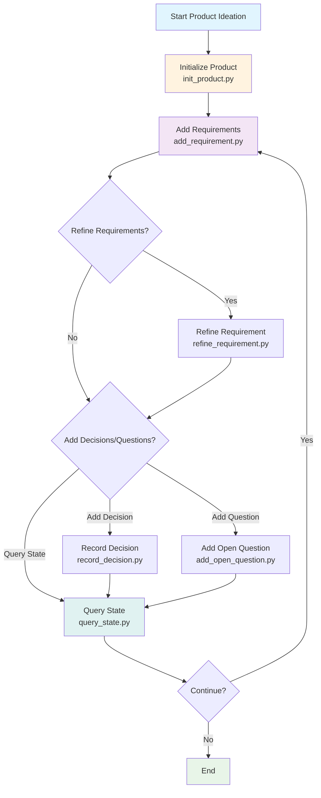

# Claude Skills Collection

A collection of custom skills and agents for [Claude Code](https://code.claude.com) that extend AI capabilities with specialized workflows, domain knowledge, and best practices.

> 📘 **[Read the full story](./ABOUT.md)** - Learn about our philosophy, architecture, and roadmap.

## Available Skills

### [friendly-python](./friendly-python)

**Python coding standards and patterns for user-friendly and maintainer-friendly code.**

Friendly Python provides comprehensive guidelines for writing Pythonic code that's both easy to use and easy to maintain. Based on Frost Ming's "Friendly Python" series, this skill encapsulates best practices for API design, code organization, and common patterns.

- **Registry Patterns** - Replace if-else chains with extensible registries
- **Context Managers** - Proper resource management with `with` statements
- **Classmethod Constructors** - Multiple input sources with clean APIs
- **Descriptors** - Explicit field definitions over `__getattr__` magic
- **Extension Points** - Use official hooks instead of custom wrappers
- **Python Idioms** - async/await, decorators, generators over callbacks

**Key Features:**
- 🎯 7 proven code patterns with good/bad examples
- ✅ Review checklist for code quality assessment
- 📚 Quick reference tables for common scenarios
- 🐍 Pythonic over ported patterns from other languages
- 🔍 Type hints and discoverability first

**Use when:**
- Writing new Python code
- Reviewing and refactoring existing code
- Designing public APIs
- Porting code from other languages to Python
- Training team members on Python best practices

[→ Learn more about friendly-python](./friendly-python/SKILL.md)

### [context-keeper](./context-keeper)

**Maintains project context through progressive disclosure and enforced documentation.**

Context Keeper implements a three-level documentation system that ensures AI agents always have accurate, up-to-date context about your codebase:

- **USERAGENTS.md** - Project-level structure, conventions, and directory index
- **TECH_INFO.md** - Directory-level file descriptions and dependencies
- **File headers** - File-level function descriptions and parameters

**Key Features:**
- 🔍 Automatic tech stack detection (TypeScript, React, Go, Python, etc.)
- 📋 Coding conventions inference based on detected stack
- 🗂️ Smart directory filtering using `.gitignore`
- 🔄 Optional stop-time documentation checks via hooks
- 📝 Enforced documentation updates via AGENTS.md instructions

**Use when:**
- Starting work on a new project
- Onboarding new team members (or AI agents)
- Maintaining context across long development sessions
- Working with complex codebases

[→ Learn more about context-keeper](./context-keeper/SKILL.md)

### [auto-browser](./auto-browser)

**Automate Chrome via Puppeteer to browse, navigate, scrape and capture web pages.**

Auto-Browser provides comprehensive tools for web automation and interaction:

- **Browser Control** - Launch Chrome instances and manage browser lifecycle
- **Page Navigation** - Open URLs, handle redirects, and manage page state
- **DOM Interaction** - Interactive element picking and JavaScript execution
- **Content Capture** - Take screenshots, extract HTML, and scrape web content

**Key Features:**
- 🌐 Full Chrome/Chromium automation via Puppeteer
- 🖱️ Interactive DOM element selection tools
- 📸 Screenshot and visual capture capabilities
- 💻 Execute custom JavaScript on pages
- 📄 HTML extraction and web scraping
- 🔄 Session management and cookie handling

**Use when:**
- Automating web interactions and testing
- Scraping content from websites
- Taking screenshots of web pages
- Testing web applications
- Gathering information from dynamic websites

[→ Learn more about auto-browser](./auto-browser/SKILL.md)

### [ideate-pm](./ideate-pm)

**Product Requirements Manager for ideation and product management.**

Ideate-PM helps manage product design information by turning a single product idea into an evolving requirements collection. It maintains a requirements database with associated design decisions and open questions:

- **Requirements Management** - Add, refine, and track product requirements with IDs
- **Decision Tracking** - Record design decisions and their rationale
- **Open Questions** - Track unresolved questions that need answers
- **State Management** - Query current product design state and backlog
- **Markdown Views** - Generate human-readable views from database

**Key Features:**
- 📋 SQLite-based authoritative storage for requirements
- 🎯 Single product per repository management
- 📝 Markdown view generation (PRODUCT.md, BACKLOG.md, OPEN_QUESTIONS.md)
- 🔍 Requirement status tracking (PROPOSED, READY, DONE)
- ⚖️ Priority management (P0, P1, P2)
- 🗂️ Decision and question tracking with scope awareness

**Use when:**
- Starting a new product ideation process
- Managing product requirements and backlog
- Tracking design decisions and open questions
- Maintaining product documentation and state
- Collaborating on product features and specifications

[→ Learn more about ideate-pm](./ideate-pm/SKILL.md)

### [cloudflare-guide](./cloudflare-guide)

**Cloudflare development assistant with access to official documentation.**

Cloudflare Guide provides quick access to official Cloudflare documentation and best practices for building with Workers, Pages, R2, D1, KV, and other Cloudflare services.

**Key Features:**
- 📚 Official documentation references
- 🔧 Wrangler configuration guidance
- ⚡ Workers and Pages development patterns
- 💾 Storage solutions (R2, D1, KV, Durable Objects)
- 🌐 Networking and security best practices

**Use when:**
- Building Cloudflare Workers or Pages applications
- Configuring Wrangler or deployment settings
- Integrating Cloudflare storage services
- Troubleshooting Cloudflare-specific issues

[→ Learn more about cloudflare-guide](./cloudflare-guide/SKILL.md)

---

### [feature-development-workflow](./feature-development-workflow)

**Systematic feature development following a 5-phase workflow: Discovery → Exploration → Documentation → Implementation → Review.**

Feature Development Workflow provides a structured approach to feature development that emphasizes documentation-first methodology, progressive context management, and systematic implementation. The workflow uses multiple specialized agents with appropriate models for different tasks.

**Key Features:**
- 🔄 5-phase systematic approach (Discovery, Exploration, Documentation, Implementation, Review)
- 🤖 Multi-model agents: Opus for deep product thinking, Haiku for fast exploration, Sonnet for architecture
- 📋 Progress persistence with automatic resume capability for interrupted work
- 📄 Documentation-first methodology with spec documents created before code
- 🧠 Fork context management preventing main session pollution
- ✅ Built-in verification and quality checks throughout the process

**Use when:**
- Implementing new features or adding functionality
- Refactoring modules or upgrading APIs
- Performing complex multi-file bug fixes
- Making architectural changes to the codebase
- Migrating databases or performing major system changes
- Following systematic development workflows

[→ Learn more about feature-development-workflow](./feature-development-workflow/SKILL.md)

---

## Available Agents

### [python-coder](./agents/python-coder.md)

**Expert Python developer following "Friendly Python" principles.**

The Python Coder agent writes, reviews, refactors, and optimizes Python code according to best practices. It automatically leverages the `friendly-python` skill to ensure code is both user-friendly and maintainer-friendly.

**Capabilities:**
- ✍️ Write new Python features with proper design patterns
- 🔍 Review code against 6-point quality checklist
- ♻️ Refactor to use registry patterns, context managers, classmethod constructors
- 🎨 Design APIs from caller's perspective (top-down)
- 📝 Type-annotated, well-documented code

**Workflow:**
1. Understand requirements and existing codebase
2. Design API from caller's perspective
3. Implement using Friendly Python patterns
4. Review against quality checklist
5. Refine and document design decisions

**Use when:**
- Writing new Python code or features
- Reviewing Python code for quality
- Refactoring legacy Python code
- Designing Python APIs or libraries
- Porting code from other languages to Python

[→ View agent definition](./agents/python-coder.md)

### [cloudflare-docs-fetcher](./agents/cloudflare-docs-fetcher.md)

**Fetch and analyze official Cloudflare documentation.**

This agent retrieves the latest official Cloudflare documentation and provides concise, actionable answers to development questions.

**Capabilities:**
- 🔎 Fetch latest official Cloudflare docs
- 📖 Answer questions about Workers, Pages, R2, D1, KV
- ⚙️ Wrangler configuration guidance
- 💡 Best practices and common patterns
- 🐛 Troubleshooting and debugging help

**Use when:**
- Questions about Cloudflare services
- Configuration or deployment issues
- API usage or feature questions
- Best practices for Cloudflare development

[→ View agent definition](./agents/cloudflare-docs-fetcher.md)

---

## ideate-pm Flowchart



The flowchart shows the main workflow of the ideate-pm skill:
1. Start by initializing a product
2. Add requirements to the product
3. Optionally refine requirements, record decisions, or add open questions
4. Query the current state of the product
5. Continue the cycle as needed

## Installation

### Option 1: Plugin Marketplace (Recommended)

Install all skills in this collection using Claude Code's plugin system:

```bash
# Add this marketplace to your local marketplaces
git clone https://github.com/YOUR_USERNAME/claude-skills.git ~/.claude/plugins/marketplaces/claude-skills-collection

# Install individual skills
claude plugin install auto-browser
claude plugin install context-keeper
claude plugin install ideate-pm
```

This method allows you to:
- Update skills with `claude plugin update <skill-name>`
- Manage skills easily with `claude plugin list` / `claude plugin disable`
- Receive updates when marketplace is updated

### Option 2: Clone the repository

```bash
git clone https://github.com/YOUR_USERNAME/claude-skills.git ~/software/claude-skills
```

Then reference the skill in your Claude Code settings:

```json
{
  "skills": [
    "~/software/claude-skills/context-keeper",
    "~/software/claude-skills/auto-browser",
    "~/software/claude-skills/ideate-pm"
  ]
}
```

Note: With this method, updates must be done manually with `git pull`.

### Option 3: Download individual skills

Download the packaged `.zip` file from [Releases](https://github.com/YOUR_USERNAME/claude-skills/releases) and install via Claude Code.

Use this if you only need one or two specific skills.

---

## Usage

### context-keeper

**Dependencies**: Python 3.7+

Initialize documentation for your project:

```bash
# If installed via plugin
python ~/.claude/plugins/cache/claude-skills-collection/context-keeper/1.0.0/scripts/scan_project.py /path/to/your/project

# If using local clone
python ~/software/claude-skills/context-keeper/scripts/scan_project.py /path/to/your/project
```

Preview changes without modifying files:

```bash
python <path-to-context-keeper>/scripts/scan_project.py /path/to/your/project --dry-run
```

Preview changes without modifying files:

```bash
python ~/software/claude-skills/context-keeper/scripts/scan_project.py /path/to/your/project --dry-run
```

Once initialized, AI agents should:
1. Read `USERAGENTS.md` and relevant `TECH_INFO.md` before modifying code
2. Update documentation after completing changes
3. Maintain accurate context throughout the session

Optional: install the hook templates to run a stop-time documentation sync check:

```bash
# Copy hooks to your project
cp -r <path-to-context-keeper>/hooks/.your-project/.claude-hooks/

# Configure in Claude Code settings
```

Example Claude Code settings (adjust paths to your environment):

Example Claude Code settings (adjust paths to your environment):

```json
{
  "hooks": {
    "SessionStart": "/absolute/path/to/context-keeper/hooks/session_start.sh",
    "PostToolUse": "/absolute/path/to/context-keeper/hooks/post_tool_use.sh",
    "Stop": "/absolute/path/to/context-keeper/hooks/stop.sh --strict"
  }
}
```

### auto-browser

**Dependencies**: Node.js 18+, Chrome/Chromium

Install dependencies:

```bash
# If installed via plugin (auto-managed)
# Dependencies are installed automatically on first use

# If using local clone
npm install --prefix <path-to-auto-browser>
```

Launch Chrome and start automating:

```bash
node <path-to-auto-browser>/scripts/start.js --profile --port 9222
node <path-to-auto-browser>/scripts/nav.js https://example.com --new
node <path-to-auto-browser>/scripts/screenshot.js --file screenshot.png --fullpage
```

### ideate-pm

**Dependencies**: Python 3.7+

Install dependencies:

```bash
# If installed via plugin
pip install -r <path-to-ideate-pm>/requirements.txt

# If using local clone
pip install -r ~/software/claude-skills/ideate-pm/requirements.txt
```

Initialize a new product:

```bash
python <path-to-ideate-pm>/scripts/init_product.py --title "Your Product Name"
```

Add requirements and track decisions:

```bash
python <path-to-ideate-pm>/scripts/add_requirement.py --description "User authentication"
python <path-to-ideate-pm>/scripts/record_decision.py --scope product --question "Which database?" --choice "PostgreSQL"
```

---

## Version Management

This project follows [Semantic Versioning](https://semver.org/) (MAJOR.MINOR.PATCH):

- **MAJOR**: Incompatible API changes
- **MINOR**: Backwards-compatible functionality additions
- **PATCH**: Backwards-compatible bug fixes

Each plugin maintains its own version:

| Plugin | Version | Changelog |
|--------|---------|-----------|
| auto-browser | 1.0.0 | [View](./auto-browser/CHANGELOG.md) |
| context-keeper | 1.0.0 | [View](./context-keeper/CHANGELOG.md) |
| ideate-pm | 1.0.0 | [View](./ideate-pm/CHANGELOG.md) |

### Updating Skills

If installed via plugin marketplace:

```bash
# Update all installed skills from this collection
claude plugin update auto-browser
claude plugin update context-keeper
claude plugin update ideate-pm

# Or update all at once
claude plugin update
```

If using local clone:

```bash
cd ~/software/claude-skills
git pull
```

For detailed change history, see [CHANGELOG.md](./CHANGELOG.md).

---

## Development

### Adding a new plugin to this marketplace

1. Create your skill directory following the standard structure:

```
new-skill/
├── SKILL.md              # Required: metadata + instructions
├── scripts/              # Optional: executable code
├── references/           # Optional: documentation/references
└── CHANGELOG.md          # Recommended: version history
```

2. Add an entry to [`.claude-plugin/marketplace.json`](./.claude-plugin/marketplace.json):

```json
{
  "name": "new-skill",
  "description": "Brief description of what this skill does",
  "source": "./",
  "version": "1.0.0",
  "category": "your-category",
  "keywords": ["keyword1", "keyword2"],
  "skills": ["./new-skill"],
  "runtime": {
    "dependencies": {
      "python": ">=3.7.0"
    }
  }
}
```

3. Update root [CHANGELOG.md](./CHANGELOG.md) with the new skill

4. Validate the marketplace:

```bash
claude plugin validate .
```

5. Commit and tag the release:

```bash
git add .
git commit -m "feat(marketplace): add new-skill plugin"
git tag -a v1.1.0 -m "Release v1.1.0 - Add new-skill"
git push && git push --tags
```

### Creating a new standalone skill

Skills follow the [Anthropic Skills specification](https://platform.claude.com/docs/en/agents-and-tools/agent-skills/best-practices):

```
skill-name/
├── SKILL.md              # Required: metadata + instructions
├── scripts/              # Optional: executable code
├── references/           # Optional: documentation/references
└── assets/               # Optional: templates/files
```

### Contributing

Contributions are welcome! Please:

1. Fork the repository
2. Create a feature branch: `git checkout -b feature/new-skill`
3. Follow the [skill authoring best practices](https://platform.claude.com/docs/en/agents-and-tools/agent-skills/best-practices)
4. Add/update CHANGELOG.md for your changes
5. Validate the marketplace: `claude plugin validate .`
6. Test your skill thoroughly
7. Submit a pull request with a clear description

**Commit Message Format**:

Use conventional commits for consistency:
- `feat(skill-name): add new feature`
- `fix(skill-name): resolve issue`
- `docs(skill-name): update documentation`
- `chore(marketplace): update plugin metadata`

---

## Philosophy

**Progressive Disclosure**: Skills use a layered approach where only relevant information is loaded into context when needed, minimizing token usage while maximizing effectiveness.

**Enforced Maintenance**: Rather than relying on agents to "remember" to update documentation, skills create mandatory workflows that make context maintenance automatic.

**Tech-Stack Aware**: Skills adapt to the specific technologies in your project, providing relevant conventions and best practices.

---

## License

MIT License - feel free to use and modify for your projects.

---

## Resources

- [Claude Code Documentation](https://code.claude.com/docs)
- [Skill Authoring Best Practices](https://platform.claude.com/docs/en/agents-and-tools/agent-skills/best-practices)
- [Claude Agent SDK](https://platform.claude.com/docs/en/agent-sdk)

---

## Author

Created with Claude Code using the [skill-creator](https://github.com/daymade-skills/skill-creator) skill.
