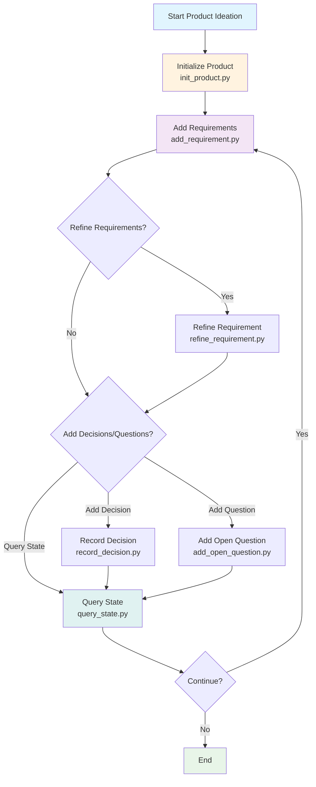

# Claude Skills Collection

A collection of custom skills for [Claude Code](https://code.claude.com) that extend AI agent capabilities with specialized workflows and domain knowledge.

## Available Skills

### [context-keeper](./context-keeper)

**Maintains project context through progressive disclosure and enforced documentation.**

Context Keeper implements a three-level documentation system that ensures AI agents always have accurate, up-to-date context about your codebase:

- **USERAGENTS.md** - Project-level structure, conventions, and directory index
- **TECH_INFO.md** - Directory-level file descriptions and dependencies
- **File headers** - File-level function descriptions and parameters

**Key Features:**
- 🔍 Automatic tech stack detection (TypeScript, React, Go, Python, etc.)
- 📋 Coding conventions inference based on detected stack
- 🗂️ Smart directory filtering using `.gitignore`
- 🔄 Optional stop-time documentation checks via hooks
- 📝 Enforced documentation updates via AGENTS.md instructions

**Use when:**
- Starting work on a new project
- Onboarding new team members (or AI agents)
- Maintaining context across long development sessions
- Working with complex codebases

[→ Learn more about context-keeper](./context-keeper/SKILL.md)

### [auto-browser](./auto-browser)

**Automate Chrome via Puppeteer to browse, navigate, scrape and capture web pages.**

Auto-Browser provides comprehensive tools for web automation and interaction:

- **Browser Control** - Launch Chrome instances and manage browser lifecycle
- **Page Navigation** - Open URLs, handle redirects, and manage page state
- **DOM Interaction** - Interactive element picking and JavaScript execution
- **Content Capture** - Take screenshots, extract HTML, and scrape web content

**Key Features:**
- 🌐 Full Chrome/Chromium automation via Puppeteer
- 🖱️ Interactive DOM element selection tools
- 📸 Screenshot and visual capture capabilities
- 💻 Execute custom JavaScript on pages
- 📄 HTML extraction and web scraping
- 🔄 Session management and cookie handling

**Use when:**
- Automating web interactions and testing
- Scraping content from websites
- Taking screenshots of web pages
- Testing web applications
- Gathering information from dynamic websites

[→ Learn more about auto-browser](./auto-browser/SKILL.md)

### [ideate-pm](./ideate-pm)

**Product Requirements Manager for ideation and product management.**

Ideate-PM helps manage product design information by turning a single product idea into an evolving requirements collection. It maintains a requirements database with associated design decisions and open questions:

- **Requirements Management** - Add, refine, and track product requirements with IDs
- **Decision Tracking** - Record design decisions and their rationale
- **Open Questions** - Track unresolved questions that need answers
- **State Management** - Query current product design state and backlog
- **Markdown Views** - Generate human-readable views from database

**Key Features:**
- 📋 SQLite-based authoritative storage for requirements
- 🎯 Single product per repository management
- 📝 Markdown view generation (PRODUCT.md, BACKLOG.md, OPEN_QUESTIONS.md)
- 🔍 Requirement status tracking (PROPOSED, READY, DONE)
- ⚖️ Priority management (P0, P1, P2)
- 🗂️ Decision and question tracking with scope awareness

**Use when:**
- Starting a new product ideation process
- Managing product requirements and backlog
- Tracking design decisions and open questions
- Maintaining product documentation and state
- Collaborating on product features and specifications

[→ Learn more about ideate-pm](./ideate-pm/SKILL.md)

## ideate-pm Flowchart



The flowchart shows the main workflow of the ideate-pm skill:
1. Start by initializing a product
2. Add requirements to the product
3. Optionally refine requirements, record decisions, or add open questions
4. Query the current state of the product
5. Continue the cycle as needed

## Installation

### Option 1: Clone the repository

```bash
git clone https://github.com/YOUR_USERNAME/claude-skills.git ~/software/claude-skills
```

Then reference the skill in your Claude Code settings:

```json
{
  "skills": [
    "~/software/claude-skills/context-keeper"
  ]
}
```

### Option 2: Download individual skills

Download the packaged `.zip` file from [Releases](https://github.com/YOUR_USERNAME/claude-skills/releases) and install via Claude Code.

---

## Usage

### context-keeper

Initialize documentation for your project:

```bash
python ~/software/claude-skills/context-keeper/scripts/scan_project.py /path/to/your/project
```

Preview changes without modifying files:

```bash
python ~/software/claude-skills/context-keeper/scripts/scan_project.py /path/to/your/project --dry-run
```

Once initialized, AI agents should:
1. Read `USERAGENTS.md` and relevant `TECH_INFO.md` before modifying code
2. Update documentation after completing changes
3. Maintain accurate context throughout the session

Optional: install the hook templates under `context-keeper/hooks/` to run a stop-time
documentation sync check.

Example Claude Code settings (adjust paths to your environment):

```json
{
  "hooks": {
    "SessionStart": "/absolute/path/to/claude-skills/context-keeper/hooks/session_start.sh",
    "PostToolUse": "/absolute/path/to/claude-skills/context-keeper/hooks/post_tool_use.sh",
    "Stop": "/absolute/path/to/claude-skills/context-keeper/hooks/stop.sh --strict"
  }
}
```

---

## Development

### Creating a new skill

Skills follow the [Anthropic Skills specification](https://platform.claude.com/docs/en/agents-and-tools/agent-skills/best-practices):

```
skill-name/
├── SKILL.md              # Required: metadata + instructions
├── scripts/              # Optional: executable code
├── references/           # Optional: documentation/references
└── assets/               # Optional: templates/files
```

### Contributing

Contributions are welcome! Please:

1. Fork the repository
2. Create a feature branch (`git checkout -b feature/new-skill`)
3. Follow the [skill authoring best practices](https://platform.claude.com/docs/en/agents-and-tools/agent-skills/best-practices)
4. Test your skill thoroughly
5. Submit a pull request

---

## Philosophy

**Progressive Disclosure**: Skills use a layered approach where only relevant information is loaded into context when needed, minimizing token usage while maximizing effectiveness.

**Enforced Maintenance**: Rather than relying on agents to "remember" to update documentation, skills create mandatory workflows that make context maintenance automatic.

**Tech-Stack Aware**: Skills adapt to the specific technologies in your project, providing relevant conventions and best practices.

---

## License

MIT License - feel free to use and modify for your projects.

---

## Resources

- [Claude Code Documentation](https://code.claude.com/docs)
- [Skill Authoring Best Practices](https://platform.claude.com/docs/en/agents-and-tools/agent-skills/best-practices)
- [Claude Agent SDK](https://platform.claude.com/docs/en/agent-sdk)

---

## Author

Created with Claude Code using the [skill-creator](https://github.com/daymade-skills/skill-creator) skill.
